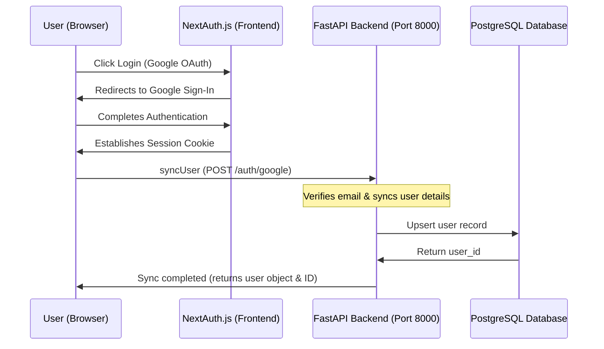

# CareerCopilot AI Frontend 🚀

CareerCopilot AI is a premium, modern AI-powered workspace designed to help job seekers optimize their resumes for specific target roles. By leveraging **Gemini 2.5 Flash**, the system cross-references uploaded resumes against target job descriptions, calculates ATS (Applicant Tracking System) compatibility scores, highlights key skill gaps, and delivers actionable, recruiter-style optimization advice.

The UI is inspired by modern SaaS applications like Linear, Stripe, Vercel, and Notion—featuring a minimal dark layout, clean progress gauges, and responsive dashboards.

---

## 📋 Table of Contents
1. [Key Features](#-key-features)
2. [Technical Flowcharts](#-technical-flowcharts)
3. [User Guide / Step-by-Step Manual](#-user-guide--step-by-step-manual)
4. [Technology Stack](#-technology-stack)
5. [Getting Started (Local Development)](#-getting-started-local-development)
6. [Environment Configurations](#-environment-configurations)
7. [Production Building & Deployment](#-production-building--deployment)

---

## ✨ Key Features

* **Vercel & Stripe-Inspired Dashboard**: A sleek, high-contrast dark interface featuring glassmorphic cards, transition animations, and visual hover feedback.
* **Smart Navigation Bar**: Integrates a disabled quick search input, instant logo home links, and an interactive user avatar dropdown menu (with profile details, settings previews, and smooth keyboard-accessible logout interactions).
* **Metrics & KPI Row**: Highlights your current ATS compliance score, semantic JD Match score, and total uploaded resume library count at a single glance.
* **Resume Library & Selection**: Supports PDF and DOCX uploads up to 5MB. Select any document from your historical upload library to load it into the optimizer workspace.
* **AI Optimizer Workspace**: Input your target job description with real-time character counters and live validation (requires a 50-character minimum for accuracy).
* **Comprehensive Skill Gap Scanner**:
  * **Score Gauges**: Animated circular SVG progress gauges showing ATS compliance and JD semantic match percentage.
  * **Skill Gaps Tagging**: Identified missing keywords and skills presented as wrapped, custom-pill rose badges.
  * **Recruiter Recommendations**: Numbered feedback cards offering actionable tips on resume editing, phrasing, and project highlighting.
* **Profile Management Page**: Clean profile summary view displaying synchronization logs, database IDs, and connection status badges.

---

## 📊 Technical Flowcharts

### 1. User Authentication & Database Synchronization Flow
This diagram details how the frontend uses NextAuth to authenticate with Google OAuth and subsequently registers or connects the user session with the PostgreSQL database API on the backend.



### 2. Resume Upload & AI Analysis Session Flow
This diagram describes the step-by-step process of choosing a resume, pasting a job description, validating input criteria, running the Gemini AI analysis, and rendering the final report.

```mermaid
graph TD
    Start([User Logs In]) --> Welcome[Dashboard Home]
    Welcome --> Upload[Upload Resume PDF/DOCX]
    Upload --> Select[Select Active Resume from Library]
    Select --> Workspace[Input Target Job Description]
    Workspace --> Validate{Min 50 Characters?}
    Validate -- No --> Error[Show Validation Warning]
    Validate -- Yes --> Submit[Run ATS Optimizer Scan]
    
    Submit --> CreateSession[1. Create Analysis Session (POST /analysis/create)]
    CreateSession --> RunGemini[2. Execute Gemini Analysis (POST /analysis/run/analysis_id)]
    RunGemini --> FetchReport[3. Retrieve Report Details (GET /analysis/analysis_id)]
    
    FetchReport --> Display[Render Optimization Insights]
    
    Display --> A[Section A: ATS Score & JD Match Score Gauges]
    Display --> B[Section B: Pill Tags for Missing Skill Gaps]
    Display --> C[Section C: Numbered list of Recruiter Tips]
```

---

## 📖 User Guide / Step-by-Step Manual

### Step 1: Authentication
1. Navigate to the website homepage.
2. Click **Get Started** or **Login** on the navigation bar.
3. Select your Google account on the secure OAuth login screen.
4. You will be redirected to the secure **Dashboard** workspace.

### Step 2: Upload Your Resumes
1. In the **Upload Resume** card on the dashboard, drag your PDF or DOCX resume directly into the dotted upload box (or click **Browse File**).
2. Once selected, verify the file name and size, then click **Upload File**.
3. Once completed, your file will appear at the top of the **Uploaded Resumes** library list.

### Step 3: Select a Resume & Open the Optimizer
1. Look at the **Uploaded Resumes** panel.
2. Click on the resume you wish to analyze.
3. The selected resume will light up with an **indigo border accent**, a checkmark indicator, and a soft glow, indicating it is active. The **ATS Optimizer Workspace** form will dynamically appear below it.

### Step 4: Run the Cross-Reference Analysis
1. Copy the target job description (e.g., from LinkedIn or Indeed).
2. Paste the text into the **ATS Optimizer Workspace** text area.
3. Keep track of the character counter at the bottom-right. The scan requires a minimum of **50 characters** of job description text.
4. Click **Run ATS Optimizer Scan**.
5. The button will change to a loading spinner showing real-time feedback (e.g., *"Gemini is running cross-reference scan..."*).

### Step 5: Review the Insights
1. Once Gemini completes the run, the insights will populate on your screen:
   * **KPI Indicators**: Check the circular rings at the top for your overall scores.
   * **Skill Gaps**: Check the red pills for critical keywords or tools mentioned in the job description that were not detected in your resume.
   * **Tips**: Read the numbered recruiter-style tips to rewrite details of your professional experience to match semantic expectations.
2. Click **Scan Another JD** to reset the form and optimize your resume for another job.

---

## 🛠️ Technology Stack

* **Framework**: [Next.js](https://nextjs.org/) (App Router, v16+)
* **UI Engine**: [React](https://react.dev/) (v19)
* **Styling**: [Tailwind CSS v4](https://tailwindcss.com/) (using PostCSS integration)
* **Authentication**: [NextAuth.js](https://next-auth.js.org/)
* **Type Safety**: [TypeScript](https://www.typescriptlang.org/)

---

## 🚀 Getting Started (Local Development)

### Prerequisites
Make sure you have [Node.js](https://nodejs.org/) installed (v18+ recommended) and the [CareerCopilot AI Backend](https://github.com/vadalasathwik/careercopilot-ai-backend) running on port `8000`.

### Setup Instructions

1. **Clone the repository and enter the directory**:
   ```bash
   cd careercopilot-ai-frontend
   ```

2. **Install project dependencies**:
   ```bash
   npm install
   ```

3. **Configure local environment variables**:
   Create a file named `.env.local` in the root of the directory (see the [Environment Configurations](#-environment-configurations) section below for variables).

4. **Launch the development server**:
   ```bash
   npm run dev
   ```

5. **Access the application**:
   Open [http://localhost:3000](http://localhost:3000) in your browser.

---

## ⚙️ Environment Configurations

Create a `.env.local` file in the root folder of the project with the following configuration keys:

```ini
# Google OAuth Configuration (obtained from Google Cloud Console)
GOOGLE_CLIENT_ID=your-google-client-id.apps.googleusercontent.com
GOOGLE_CLIENT_SECRET=your-google-client-secret

# NextAuth Configuration
NEXTAUTH_SECRET=your-random-32-byte-hexadecimal-secret-string
NEXTAUTH_URL=http://localhost:3000

# Backend API Endpoint URL
NEXT_PUBLIC_API_URL=http://127.0.0.1:8000
```

---

## 📦 Production Building & Deployment

To verify TypeScript and compile a production-ready Next.js bundle:

```bash
npm run build
```

The output build outputs static routes (`○`) and dynamic server-rendered endpoints (`ƒ`) compiled with Next.js Turbopack:

```text
Route (app)
┌ ○ /
├ ○ /_not-found
├ ƒ /api/auth/[...nextauth]
├ ○ /dashboard
├ ○ /login
└ ○ /profile
```

### Deploying to Vercel
This project is configured for one-click deployments to Vercel:
1. Connect your GitHub repository to [Vercel](https://vercel.com).
2. Configure the same Environment Variables under Project Settings.
3. Deploy! Vercel will automatically build the static page dependencies.
