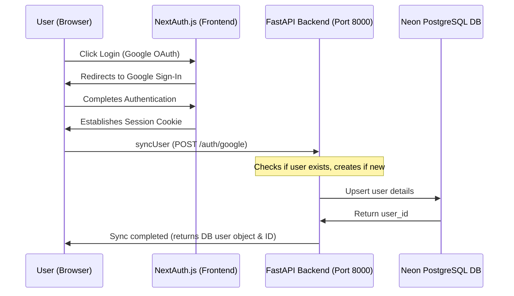
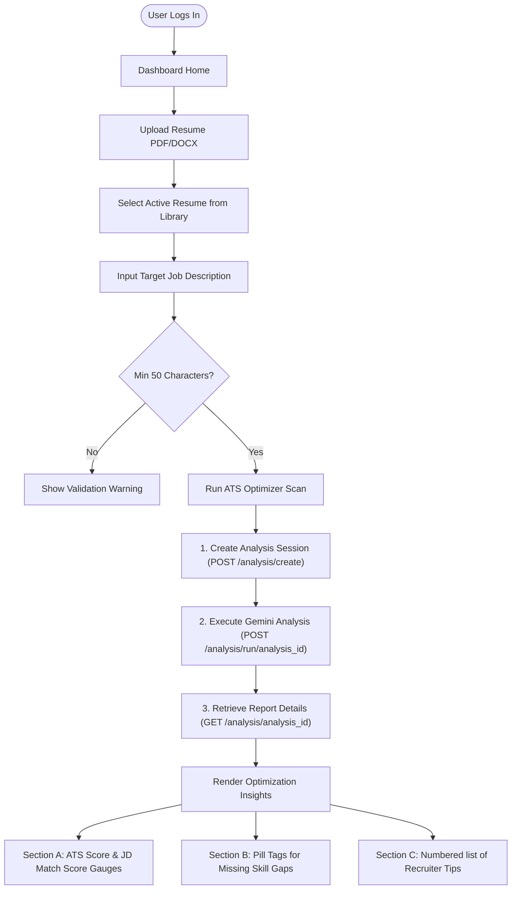

# CareerCopilot AI - Professional Resume & ATS Optimizer 🚀

CareerCopilot AI is a full-stack, AI-powered workspace designed to help job seekers optimize their resumes for target job descriptions. Using **Google Gemini 2.5 Flash**, the system automatically scans uploaded resumes against target job descriptions, calculates ATS (Applicant Tracking System) formatting compliance, determines semantic JD matching rates, highlights critical missing skills, and delivers actionable recruiter-style recommendations.

This repository document serves as the project-wide overview for the entire CareerCopilot AI ecosystem, including the **Next.js Frontend**, **FastAPI Backend**, **PostgreSQL Database**, and **Supabase Storage** integrations.

---

## 📋 Table of Contents
1. [System Architecture](#%EF%B8%8F-system-architecture)
2. [Data Flow & Integration Flowcharts](#-data-flow--integration-flowcharts)
3. [Repository Structure](#-repository-structure)
4. [Backend API Service Setup](#-backend-api-service-setup)
5. [Frontend App Service Setup](#-frontend-app-service-setup)
6. [User Manual / Step-by-Step Guide](#-user-guide--step-by-step-manual)
7. [API Contract Overview](#-api-contract-overview)

---

## ⚙️ System Architecture

The application is split into decoupled services:

```text
                     +---------------------------------------+
                     |         Browser / User Client         |
                     +---------------------------------------+
                                   |           |
                     OAuth & Pages |           | HTTP API
                                   v           v
  +----------------------------------+       +----------------------------------+
  |        Next.js Frontend          |       |         FastAPI Backend          |
  |  - React 19 / NextAuth.js        |       |  - SQLAlchemy ORM / Alembic      |
  |  - Tailwind CSS v4 / PostCSS     |       |  - Uvicorn / CORS Middleware     |
  +----------------------------------+       +----------------------------------+
                                                       |           |           |
                                    File Uploads / URLs|           | SQL       | Gemini AI
                                                       v           v           v
                                                [Supabase]      [Neon DB]   [Google AI]
                                                S3 Bucket       PostgreSQL  Gemini 2.5
```

* **Frontend**: Next.js App Router (React 19) styled with Tailwind CSS v4, utilizing NextAuth.js for Google OAuth session security.
* **Backend**: FastAPI web framework (Python) running on Uvicorn, utilizing SQLAlchemy for PostgreSQL database access and Alembic for schema migrations.
* **AI Engine**: Google Gemini 2.5 Flash API executing semantic parsing, gap analysis, and recommendation generation.
* **Database**: Serverless PostgreSQL database hosted on Neon, storing user credentials, resume metadata, and historical analysis reports.
* **Storage**: Supabase Storage buckets storing raw PDF and DOCX resume files.

---

## 📊 Data Flow & Integration Flowcharts

### 1. Account Synchronization & Authentication Flow
This diagram details the sequence when a user logs in via Google OAuth and the frontend registers their profile with the PostgreSQL database.



### 2. Resume Upload & AI Analysis Flow
This flowchart describes the end-to-end user workspace flow from uploading files to generating matching recommendations.



---

## 📂 Repository Structure

The project code is divided into two separate project directories:

### 1. Backend Service (`/careercopilot-ai-backend`)
* `app/main.py`: Main FastAPI entrypoint with CORS configuration.
* `app/routers/`: Router routes for auth, resume storage, and analysis reports.
* `app/models/`: SQLAlchemy DB models (`User`, `Resume`, `Analysis`).
* `app/services/`: Core logic helpers including `gemini_service` and `supabase_service`.
* `alembic/`: Alembic database migration scripts.
* `requirements.txt`: Python package dependencies.
* `venv/`: Local Python virtual environment.

### 2. Frontend App (`/careercopilot-ai-frontend`)
* `src/app/dashboard/page.tsx`: Core SaaS workspace page.
* `src/app/profile/page.tsx`: Synchronized user profile account page.
* `src/components/`: Reusable components (e.g., `DashboardNavbar`, `ProfileCard`).
* `src/components/resume/`: Child upload components and resume list selectors.
* `src/components/analysis/`: Target job description forms and formatted results displays.
* `src/lib/`: API client handlers for authentication, resume, and analysis communication.
* `package.json`: NPM scripts and dependencies (Next.js v16+, React v19, Tailwind v4).

---

## 🐍 Backend API Service Setup

Make sure you have Python 3.10+ installed.

1. **Navigate to the backend directory**:
   ```bash
   cd careercopilot-ai-backend
   ```

2. **Set up the virtual environment**:
   * Windows:
     ```powershell
     python -m venv venv
     .\venv\Scripts\activate
     ```
   * Mac/Linux:
     ```bash
     python3 -m venv venv
     source venv/bin/activate
     ```

3. **Install dependencies**:
   ```bash
   pip install -r requirements.txt
   ```

4. **Configure environment variables**:
   Create a `.env` file in the root of `/careercopilot-ai-backend`:
   ```ini
   DATABASE_URL=postgresql://your-neon-postgres-connection-string
   SUPABASE_URL=https://your-supabase-project.supabase.co
   SUPABASE_SERVICE_ROLE_KEY=your-supabase-service-key
   GEMINI_API_KEY=your-google-gemini-api-key
   ```

5. **Run database migrations**:
   ```bash
   alembic upgrade head
   ```

6. **Start the API server**:
   ```bash
   uvicorn app.main:app --port 8000 --reload
   ```
   The backend API will run on [http://localhost:8000](http://localhost:8000).

---

## 💻 Frontend App Service Setup

Make sure you have Node.js 18+ installed.

1. **Navigate to the frontend directory**:
   ```bash
   cd careercopilot-ai-frontend
   ```

2. **Install node dependencies**:
   ```bash
   npm install
   ```

3. **Configure environment variables**:
   Create a `.env.local` file in the root of `/careercopilot-ai-frontend`:
   ```ini
   # Google OAuth Credentials
   GOOGLE_CLIENT_ID=your-google-client-id.apps.googleusercontent.com
   GOOGLE_CLIENT_SECRET=your-google-client-secret

   # NextAuth Security
   NEXTAUTH_SECRET=your-random-32-byte-hexadecimal-string
   NEXTAUTH_URL=http://localhost:3000

   # Public API Endpoint
   NEXT_PUBLIC_API_URL=http://127.0.0.1:8000
   ```

4. **Start the development server**:
   ```bash
   npm run dev
   ```
   The frontend application will be active at [http://localhost:3000](http://localhost:3000).

---

## 📖 User Guide / Step-by-Step Manual

1. **Authentication**: Access `http://localhost:3000`, click **Login**, and complete Google OAuth sign-in. This automatically logs your account details and synchronizes your record in PostgreSQL.
2. **Upload Resumes**: Drag and drop a PDF or DOCX resume into the upload panel. Files are pushed to a secure Supabase storage bucket, and metadata is updated in the database.
3. **Select Active Document**: Click on your uploaded resume in the library list. It will display a glowing active outline, showing that it is selected for optimization.
4. **Define Target Job Description**: Paste the text of the role you are applying to. Keep typing until you pass the 50-character minimum verification.
5. **Run Optimizer Analysis**: Click **Run ATS Optimizer Scan**. Uvicorn delegates the processing to the Gemini API, which extracts skills and rates structural alignment.
6. **Review Insights**:
   * Circular rings display your score percentages.
   * Red badge pills display missing keywords.
   * Bordered text cards provide recruiter-style resume optimization tips.

---

## 🔗 API Contract Overview

The FastAPI backend exposes the following endpoints:

### Auth Router (`/auth`)
* `POST /auth/google`: Receives Google profile credentials, synchronizes the user in the PostgreSQL DB, and returns the DB user object.

### Resume Router (`/resume`)
* `POST /resume/upload`: Uploads resume files (PDF/DOCX) to Supabase Storage and records details in the database.
* `GET /resume/{user_id}`: Returns all resumes uploaded by the specified user.

### Analysis Router (`/analysis`)
* `POST /analysis/create`: Initializes a new analysis session for a specific user and resume ID.
* `POST /analysis/run/{analysis_id}`: Executes the Gemini AI scanner, updating the analysis record with scores, missing skills, and recommendations.
* `GET /analysis/{analysis_id}`: Retrieves the detailed analysis record.
* `GET /analysis/user/{user_id}`: Returns the complete historical log of analyses generated by the user.
